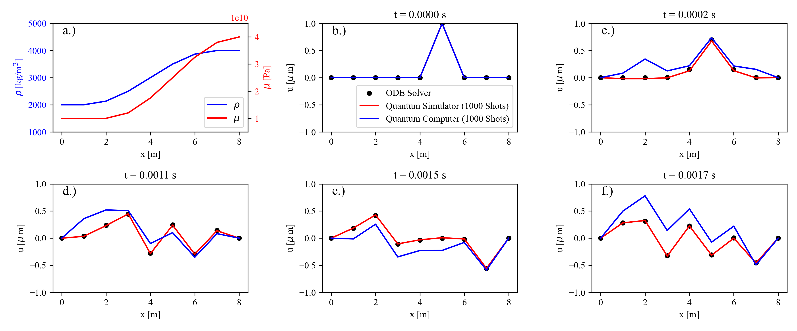
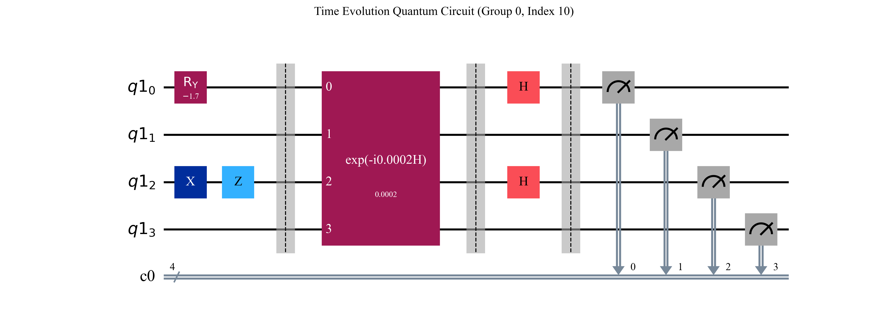

# Quantum Elastic Wave Equation Solver

> Open-source, 1D quantum computing elastic wave equation solver.

# 

> Figure 1: Calculated wave field of classical numerical solvers and the quantum computer IBM Brisbane for different evolution times in a heterogeneous medium.

## Overview
Quantum computing promises exponential runtime and space advantages compared to some classical computational algorithms. 

We present a numerical implementation of the theoretical advancements made in our publication [A quantum computing concept for 1-D elastic wave simulation (12/2023)](https://arxiv.org/abs/2312.14747/) targeting the forward simulation of wave fields in heterogeneous media through quantum hamiltonian time evolution with potentially exponential time and space savings.

The implemented code can solve small wave propagation problems for arbitrary media and initial conditions using a classical Ordinary-Differential-Equation Solver, a Matrix-Exponential Solver, local/cloud-based quantum simulators, or actual quantum computing backends through the open-source toolkit [Qiskit](https://arxiv.org/abs/2312.14747/).

This codebase aims to provide a first hands-on tool set for computing small-scale elastic wave-propagation problems on actual quantum hardware.

## Installation
We provide a **requirements** file specifying necessary dependency installations. We recommend creating a new Python environment when installing this project.

1) `git clone https://github.com/malteschade/Quantum-Wave-Equation-Solver`
2) `conda create --name qcws python=3.12`
3) `conda activate qcws`
4) `pip install -r requirements.txt`

## Usage
The project contains two **main** files with equivalent code: a Jupyter Notebook and a Python file.

The code is built around the object **ForwardExperiment1D**, which serves as an entry point defining experimental settings such as initial conditions, medium parameters, boundary conditions, evolution time, and the backend settings. Verbose process tracking is provided, and the complete source code is thoroughly documented for successful usage.

The code uses a data persistency system that allows for the reuse of previous experimental data and includes the automatic fetching of finished Qiskit jobs which have been successfully transmitted, even when the local execution was stopped. 

The quantum simulation results are provided in multiple plots that compare different time evolution methods for different time steps and the connected deviations. 

Enjoy your quantum wave evolution experiments!

# 

> Figure 2: A quantum circuit for the time evolution problem shown in Figure 1 with four distinct algorithmic sections.

## References
* Schade, M., Bösch, C., Hapla, V.,and Fichtner, A. (2023). [A quantum computing concept for 1-D elastic wave simulation](https://arxiv.org/pdf/2312.14747.pdf), arXiv:2312.14747 [physics.geo-ph].